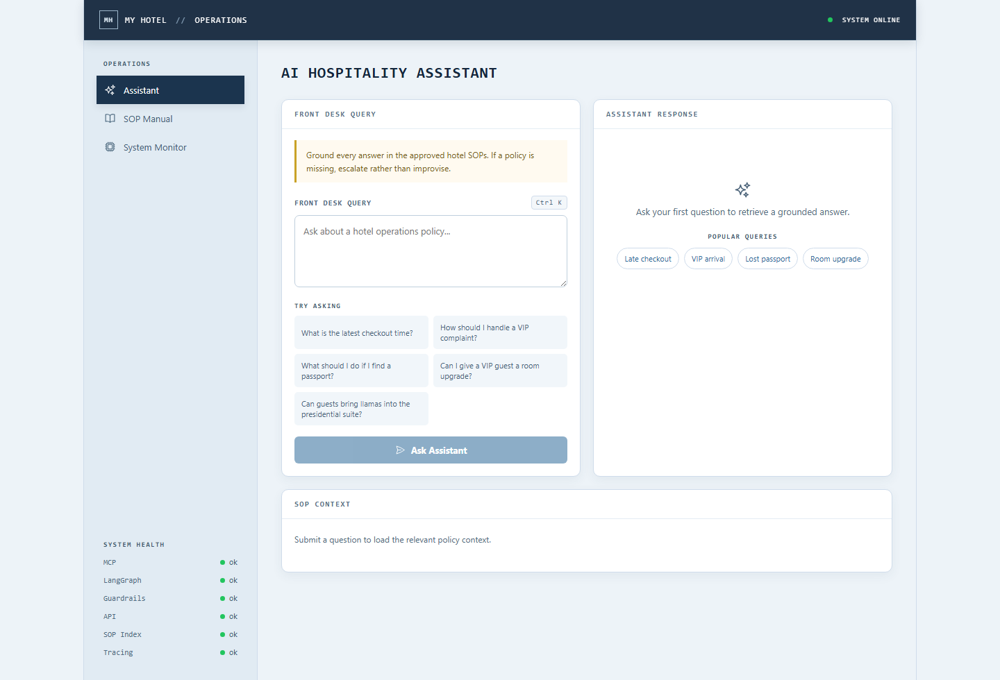
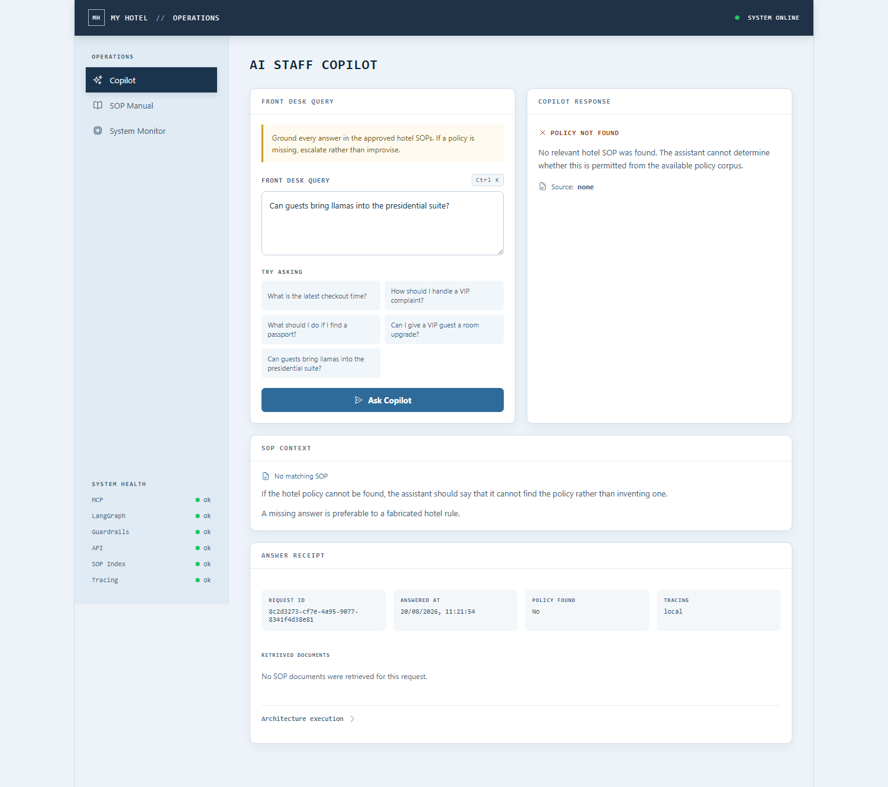
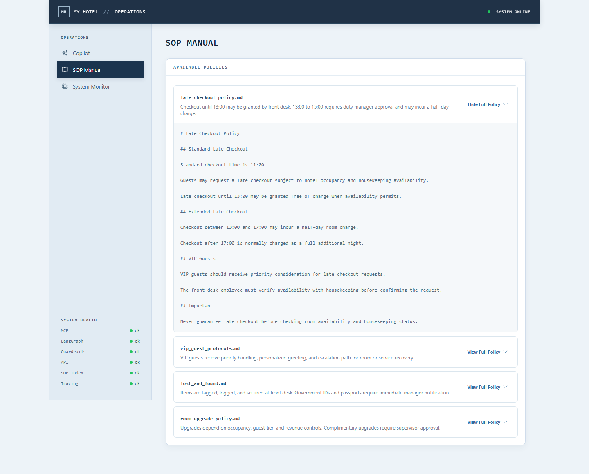
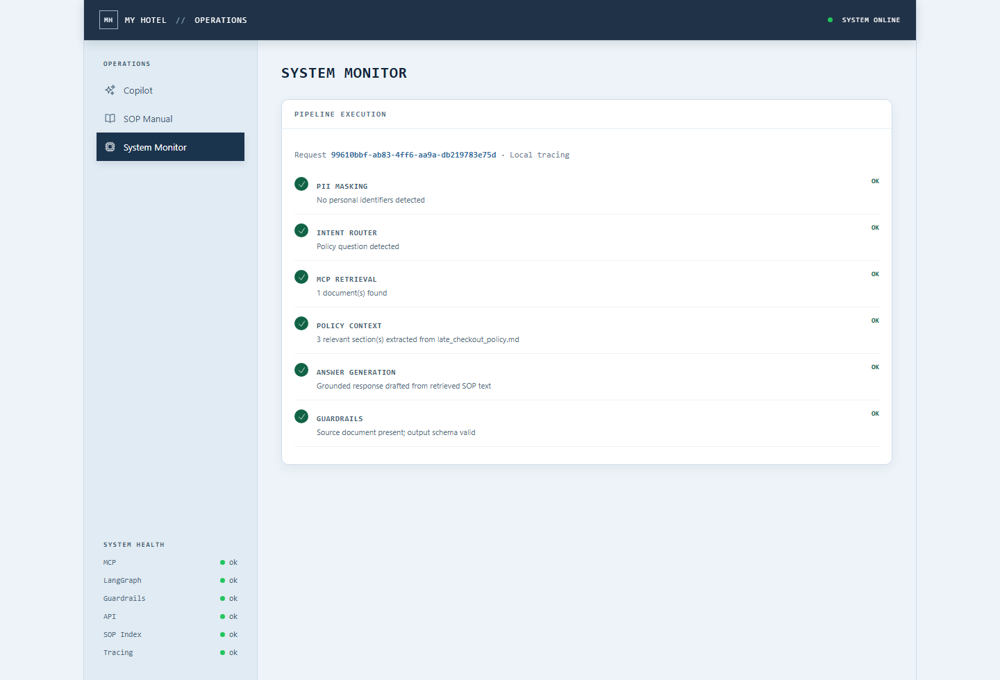

# AI Staff Copilot

Front-desk copilot that answers hotel policy questions from approved SOP manuals. Retrieval is isolated behind [MCP](https://modelcontextprotocol.io/), so the agent reasons over policy context instead of inventing it.

[View Architecture Documentation](./docs/adr/ARCHITECTURE.md)

## Features

- Grounded answers from Markdown SOP manuals, with source citations
- Refusal when no relevant policy is found (no invented rules)
- PII masking for emails and phone numbers before the graph runs
- Per-request pipeline receipt (request ID, timestamp, retrieved documents, tracing mode)
- Operations UI: copilot, SOP browser, and system monitor
- Opt-in LangSmith tracing; local receipts still appear without credentials

## Screenshots

### Copilot



### Grounded answer


### Policy not found



### SOP Manual



### System Monitor



## Stack

| Layer | Technology |
| --- | --- |
| Frontend | React, TypeScript, Vite |
| API | FastAPI |
| Orchestration | LangGraph |
| Retrieval | MCP server (`stdio`) + keyword search |
| Validation | Pydantic response models |
| Tests | pytest, Vitest |

## Requirements

- **Backend / MCP:** Python 3.11+ (FastAPI, LangGraph, MCP server)
- **Frontend:** Node.js 20+ and npm (Vite + React UI only)

The API itself does not use Node.js. Skip the Node install if you only run `uvicorn`.

## Local development

Start the API and the Vite app in separate terminals. The backend launches the MCP server over stdio on startup.

### 1. Backend

```bash
cd backend
python -m venv .venv
```

Windows:

```powershell
.venv\Scripts\activate
pip install -r requirements.txt
uvicorn main:app --host 127.0.0.1 --port 8000
```

macOS / Linux:

```bash
source .venv/bin/activate
pip install -r requirements.txt
uvicorn main:app --host 127.0.0.1 --port 8000
```

Optional standalone MCP process (the API already starts this for you):

```bash
cd mcp_server
python server.py
```

### 2. Frontend

```bash
cd frontend
npm install
npm run dev
```

Vite proxies `/health`, `/assistant`, and `/sop` to `http://127.0.0.1:8000` in development.

### 3. Environment

From the repository root:

```bash
cp .env.example .env
```

PowerShell:

```powershell
Copy-Item .env.example .env
```

Also copy `frontend/.env.example` to `frontend/.env` when you need to override Vite defaults.

Never commit `.env` files or production credentials.

| Variable | Purpose |
| --- | --- |
| `VITE_API_URL` | Backend origin for the frontend (dev default: Vite proxy) |
| `VITE_SITE_URL` | Public origin for Open Graph / canonical URLs |
| `API_URL` | Backend origin used by local tooling |
| `LANGSMITH_TRACING` / `LANGCHAIN_TRACING_V2` | Enable LangSmith when `true` |
| `LANGSMITH_API_KEY` / `LANGCHAIN_API_KEY` | LangSmith API key |
| `LANGSMITH_PROJECT` / `LANGCHAIN_PROJECT` | Trace project name (default `ai-staff-copilot`) |
| `OPENAI_API_KEY` | Reserved; answers are currently extracted from SOP text, not an LLM |
| `MCP_SERVER_URL` | Reserved; the live path uses stdio, not HTTP |

## API

| Method | Path | Description |
| --- | --- | --- |
| `GET` | `/health` | API, MCP, SOP index, and tracing status |
| `GET` | `/sop/{document_name}` | Full SOP document via MCP resource |
| `POST` | `/assistant/query` | Policy question → grounded answer + receipt |

```json
POST /assistant/query
{ "query": "What is the latest checkout time?" }
```

Successful responses include `X-Request-ID` and a structured body: answer text, source document, SOP sections, pipeline steps, and an answer receipt.

## Testing

From the repository root:

```bash
pytest -v
```

Frontend:

```bash
cd frontend
npm test
```

Covered today: MCP search and ranking, PII masking, request IDs and receipts, grounded refusals, and frontend query/receipt behavior.

## Project structure

```text
backend/                 FastAPI app, LangGraph graph, MCP client
mcp_server/              MCP resources + search_sop_manuals
mcp_server/sop_manuals/  Markdown hotel policies
frontend/                Operations UI
docs/adr/ARCHITECTURE.md System design
docs/adr/                Architecture decision records
docs/screenshots/        README UI captures
```

## License

MIT. See [`LICENSE`](LICENSE).
